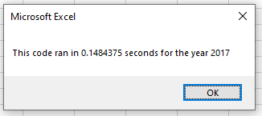
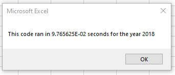

# Results and Refactor of Stock Analysis
An analysis of green energy company stock data and the results of refactoring the code that analyzed the data

## Overview of Project: 
In order to analyze stock data, I created a VBA script to collect the values from a spreadsheet and output results on a seperate sheet. The code was sound and worked, but was not efficient enough to do large datasets. After comparing the results of two different years of stock data, I will detail a refactoring of that code and an analysis on the perfomance boost it produced.

## Results: 

### Stock performance between 2017 and 2018
Based on the results found by both the original and refactored scripts, **2017 was a much better year** for green energy securities than 2018. 

Not only were all but one company's yearly returns in 2017 positive, but nearly half had exceeded 100% returns that year. As a whole these green tech companies returned **an average of 67.3%** 

In 2018 numbers were far worse, with only two companies being in the positive, with nearly half of comapanies having losses of -20% or worse and an overall **average loss of -8.5%**

### Refactored Code
The most significant change made to the code was looping through the stock data only once instead of looping through it once for every stock ticker value (a total of 11 times). We can see here in the original code that the ticker to search is updated after the loop completes

The new code avoids this by changing the ticker value after the last value of a given ticker is reached. This was an easy addition since we already were finding the last available value for a given ticker in order to stop adding the next tickers values. Note how at the end of the code below the ticker is updated whenever the last value has been read.

**...**

### Execution Times
With these changes in place **significant improvements in speed were produced**. Lets check the differences side by side, with the old value on the left

 

 

As we can see above the speed is improved by nearly a factor of 10, which neatly corresponds to running the loop 10 less times

## Summary:

### What are the advantages or disadvantages of refactoring code?
### How do these pros and cons apply to refactoring the original VBA script?
